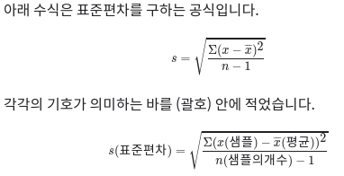

## 목차

### 1. 배열은 가까이에~ 기본 통계 데이터를 계산해 볼까?
1) 평균 계산하기
2) 배열을 활용한 평균, 표준편차, 중앙값 계산

### 2. 끝판왕 등장! numpy로 이 모든걸 한방에!
  1) NumPy 소개
  2) 주요기능
  3) NumPy로 기본 통계 데이터 계산 해보기

### 3. 데이터의 행렬 변환
  1) 이미지 데이터의 행렬 변환

### 4. 구조화된 데이터란?
  1) 간단한 dictionary를 활용한 판타지 게임 logic 설계
  2) 구조화된 데이터와 pandas
  3) Pandas와 함께 EDA 시작하기
  
     
     
  
  - 시그마 : 어떤 숫자의 배열이 있을 때 그 안의 원소를 모두 더하는 연산
  - 분산 : 편차 제곱합의 기대값
  - 표준편차 : 편차들의 제곱의 합의 제곱근
  - n-1로 나누는 의 의미 : 불편 추정량
 
  
  - TODO 읽기 https://hsm-edu.tistory.com/13
  
  -
### numpy
 - nbarray
 - arange() / reshape9) / 
 - 브로드 캐스팅
 
### 이 슬라이싱의 결과는 
print(A[:,2:])
print(A[:,1:])
print(A[:,:])

### 이 슬라이싱의 결과와 동일합니다.
print(A[:,-1:])
print(A[:,-2:])
print(A[:,-3:])

- 정규분포 / 균등분포

-렬 전치 행

