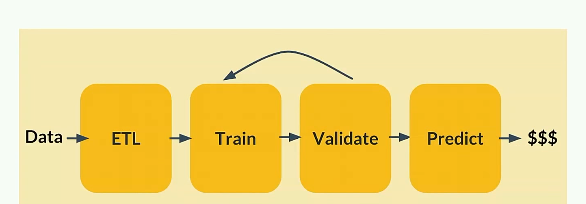
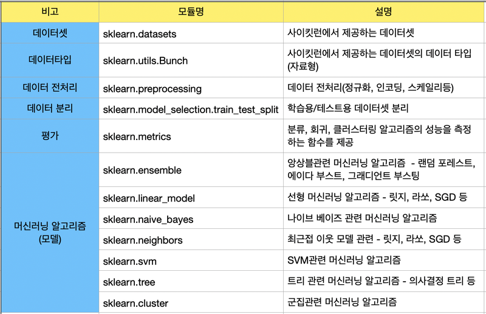
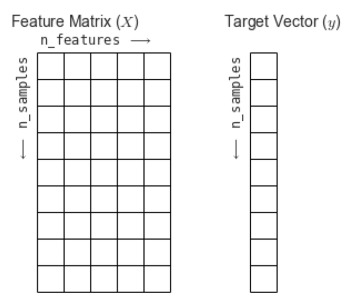

##학습목표
- 머신러닝의 다양한 알고리즘을 소개합니다.
- 사이킷런 라이브러리의 사용법을 익힙니다.
- 사이킷런에서 데이터를 표현하는 방법에 대해 이해하고 훈련용 데이터셋과 테스트용 데이터셋으로 데이터를 나누는 방법을 이해합니다.

##목차
1. 다양한 머신러닝 알고리즘

2. 사이킷런에서 가이드하는 머신러닝 알고리즘

3. Hello Scikit-learn

4. 사이킷런의 주요 모듈
4.1. 데이터 표현법
4.2. 회귀모델 실습S
4.3. datasets 모듈
4.4. 사이킷런 데이터셋을 이용한 분류 문제 실습
4.5. Estimator

5. 훈련 데이터와 테스트 데이터 분리하기

### 지도학습
- 분류(<classification) : 이진분류, 다중 클래스 분류, 범주형 변수를 예측
- 회귀(Regression): 연속 값을 예측할때(주가)
- 예측(forecasting): 미래를 예측하는 과정(트렌드, 일기예보)

### 준지도 학습 (semi-supervised learning)
-  준지도 학습은 학습 정확성을 개선하기 위해 미분류 사례와 함께 소량의 분류(labeled) 데이터 이용

### 비지도(자율) 학습 _ unsupervised learing
- 비지도 학습을 수행할 때 기계는 미분류 데이터만을 제공
- 클러스팅 : 특정 기준에 따라 유사한 데이터 사례들을 하나의 세트로 그룹화
- 차원 축소: 고려 중인 변수의 개수를 줄이는 작업

### 알고리즘 선택시 고려 사항:알고리즘을 선택할 때에는 언제나 정확성, 학습 시간, 사용 편의성을 고려

### 특정 알고리즘을 사용하는 시점
https://blogs.sas.com/content/saskorea/2017/08/22/%EC%B5%9C%EC%A0%81%EC%9D%98-%EB%A8%B8%EC%8B%A0%EB%9F%AC%EB%8B%9D-%EC%95%8C%EA%B3%A0%EB%A6%AC%EC%A6%98%EC%9D%84-%EA%B3%A0%EB%A5%B4%EA%B8%B0-%EC%9C%84%ED%95%9C-%EC%B9%98%ED%8A%B8/
- 선형회귀
- 로지스특 회귀

### 강화학습 reinforcement learning
- 환경으로 부터의 피드백을 기반으로 행위자의 행동을 부석하고 최적화
--> 에이전트: 학습주체
--> 환경: 주어진 환경조건
--> 행동: 환경으로부터 주어진 정보를 바탕으로 에이전트가 판단한 행동
--> 보상 : 행동에 대한 보상 설계
#### 강화학습 알고리즘
- Monte Carlo methods
- Q-Learning
- Policy Gradient methods

#### scikit learn API
- https://www.youtube.com/watch?time_continue=6&v=WCEXYvv-T5Q&feature=emb_logo

- ETL : data 전처리   
   --> Categorical expansion   
   --> null imputation   
   --> feature scaling   
   ==> transformer()   
- train   
   --> model("estimator")    Estimator -  하나의 Pipline으 
      == .fit(X,y)
      == .predict(X)
      
  로
- validate   

-predict   

## 데이터 표현법
- NumPy의 ndarray, Pandas의 DataFrame, SciPy의 Sparse Matrix

#### 특성행렬(feature Matirx)
-입력데이터, 특성, 데이터 수치 값, 이산값 개별 관측치, (열)
-표본(sample)
-n_samples : 행의 개수 / n_feautes 열의 개수

#### target vector
- 입력데이터의 정답 라벨, 

