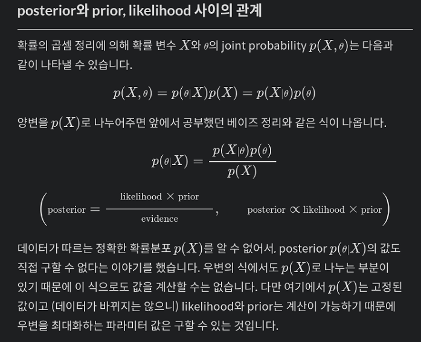
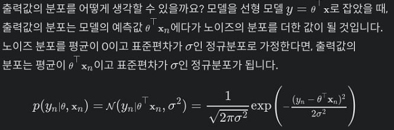
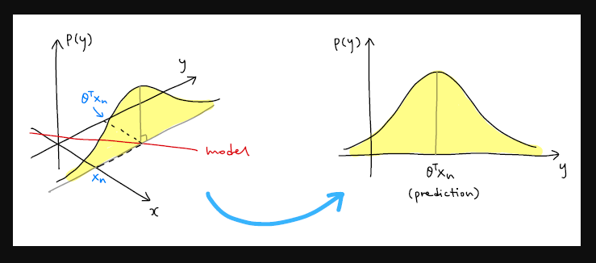

# Likelihood(MLE와 MAP)

## 확률 변수 , 모델 파리미터
- y =ax +b /   a,c ∈ R
- R**2(a,b)는 파리미터 공간
 
## 베이지안 머신러닝 모델
### 사전확률: 데이터를 관찰하기 전 파리미터 공간에 주어진 확률분포 p(θ)

- θ = [a,b]
- x = [x,1]

### 가능도(likehood, 우도) p(X=x|θ)
- 주어진 파리미터 분포에 대해서 우리가 갖고 있는 데이터가 얼마나 그럴들한지
- L(θ|x)

### 최대 가능도 추정(maximum likelihood estimation, MLE)
- 가능도를 최대화하는 방향으로 모델을 학습시키는 방법

### 사후 확률 posterior
- 데이터를 관찰한 후 계산되는 확률
- p(θ|X) 

### 최대 사후 확률 추정 (maximum a posterioir estimation MAP)
- 사전확률과 가능도를 관한 식을 변형해서 식을 최대화하는 파리미터 θ를 찾는다.

### posterior와 prior, likelihood 사이의 관계 
-TODO 이해하기

###  like hood .. 
- TODO 이해하기
- 특정 데이터가 관찰될 확률  p(X=x|θ)
- 입력 데이터의 집합을 X, 라벨들의 집합을 Y
- 라고 할때, likelihood는 파라미터와 입력 데이터가 주어졌을 때 출력값(라벨)의 확률 분포, 즉 p(Y|θ,X)
- 데이터 하나의 likelihood p(yn|θ,xn)

