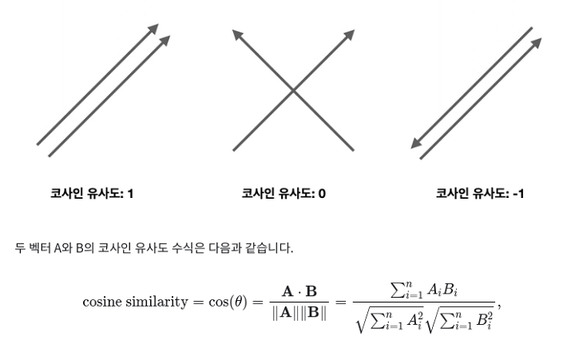
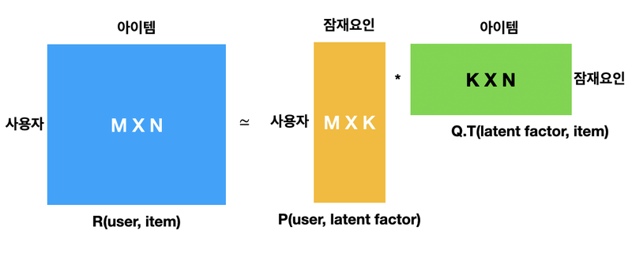

# 사이킷런을 활용 추천 시스템 입문


## 코사인 유사도(cosine similarity)
- 유사도 -1 ~ 1 사이, 1에 가까울 수록 유사도가 높음.
- 완전히 동일 1 / 90도면 0/ 180 -1/


```
from sklearn.metrics.pairwise import cosine_similarity

cosine_similarity(   )

```

## 추천시스템의 종류
- 콘텐츠기반 필터링
- 협업 필터링
- 딥러닝 적용 or 하이브리드

## 콘텐츠기반 필터링 ( contents based filtering)
- 콘텐츠 자체의 정보, 특성을 고려하여 유사한 콘텐츠를 추천
- TODO list

## 협업 필터링
- 과거 사용자 행동양식(user behavior) 데이터 기반을 바탕으로 추천
- 희소 행렬
- 사용자기반 / 아이템 기반 / 잠재 요인 방식
- 유사도: 사용자, 아이템 기반
- 행렬 인수분해: 잠재요인
- 사용자 기반: 당신과 비슷한 고객들이 다음상품을 구했습니다.
- 아이템 기반: 이 상품을 선택한 다른 고객들은 다음 상품을 구매했습니다.


## 협업 필터링 - 행렬 인수분해
### 기법
- SVD(Singular Vector Decomposition)
- ALS(Alternating Least Squares)
- NMF(Non-Negative Factorization)
 
### svd (singular vector decomposition)
- 특잇값 분해
- https://angeloyeo.github.io/2019/08/01/SVD.html
- https://darkpgmr.tistory.com/106

### Truncated SVD
-  LSA(Latent semantic analysis), 잠재 의미 분석




- 인수분해 추천시스템 적용 영상
- https://www.youtube.com/watch?time_continue=3&v=ZspR5PZemcs&feature=emb_logo


## 클릭률 CTR(click Through Rate)


 