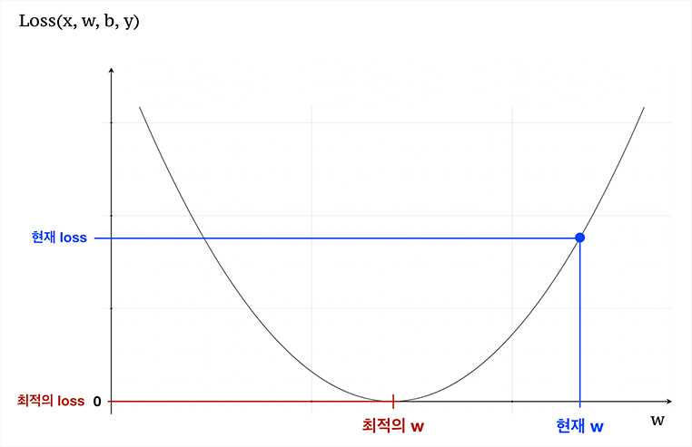
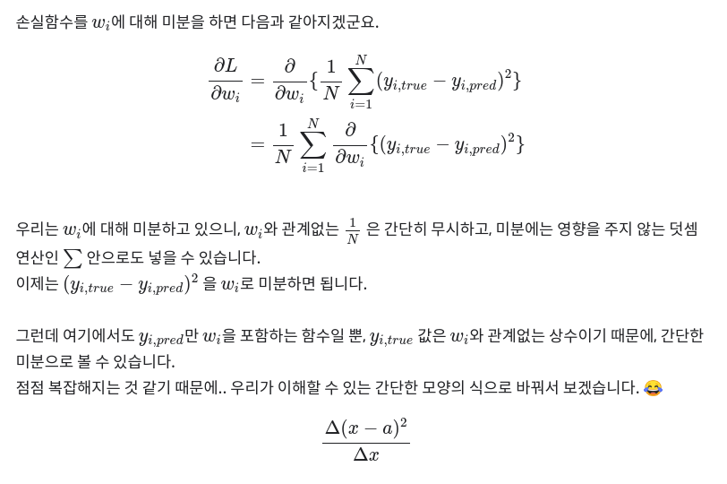
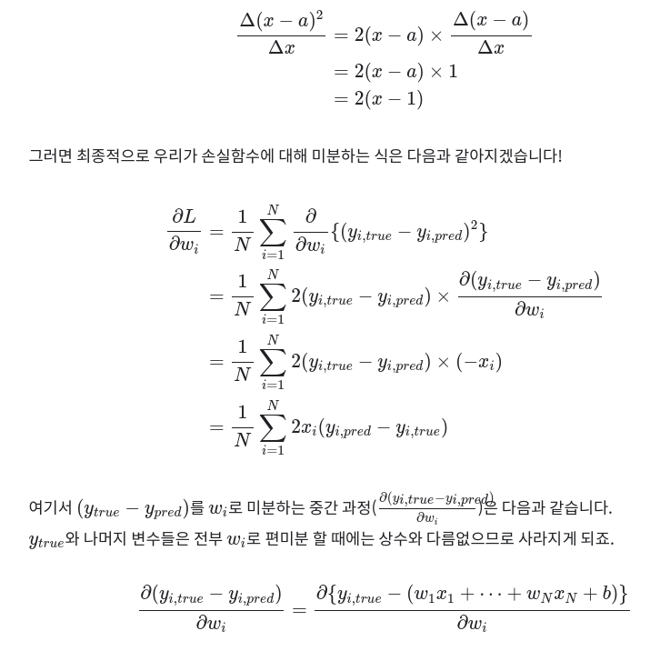

- 날씨 좋은 월요일 오후 세 시, 자전거 타는 사람은 몇 명?

## 목차
- Step 1. 단 하나의 정보, "사용한 연수"만 가지고 맥북의 중고가 맞춰보기
- Step 2. 이번엔 하나가 아니다! 다양한 정보로 원하는 값을 예측해 보기
- 프로젝트 1 : 손수 설계하는 선형회귀, 당뇨병 수치를 맞춰보자!
- 프로젝트 2 : 날씨 좋은 월요일 오후 세 시, 자전거 타는 사람은 몇 명?

## 모델 오차 - 손실함수(loss), 비용함수(cost)
- 모델이 예측하는 출력값과 정답값 간의 거리를 나타내는 함수

- MAE : Mean Absolute Error, 오차의 절댓값의 평균   
- MSE : Mean Squared Error, 오차의 제곱의 평균   
- RMSE : Root Mean Squared Error, MSE의 제곱근   
- R-squared : Coefficient of Determination, 결정 계수

## 기울기와 경사하강법(Gradient Descent)

 - 하이퍼 파리미터
 - learning rate
 
 
 ##
  - one - hoe encoding
  
  ### 선형 회귀/
- 선형 방정식 을 통해 회귀 문제를 푼다 
- 회귀 라는 단어는 연속된 실수값을 예측하는 문제 를 뜻합니다.
- 회귀와 대립되는 개념은 분류

### 표기법
 b  대신 x0 * 1로 표기하기도함.
 
 
 
 ### 손실함수 미분 
 - TODO 이해하기
 
 
