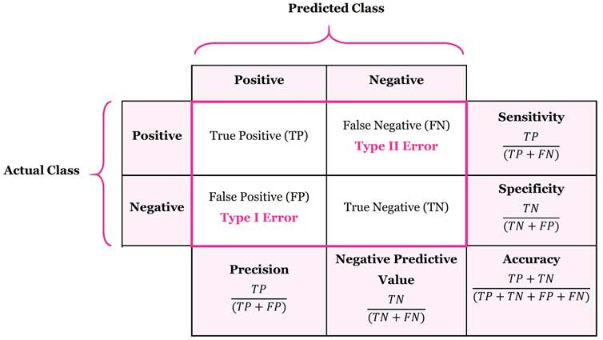
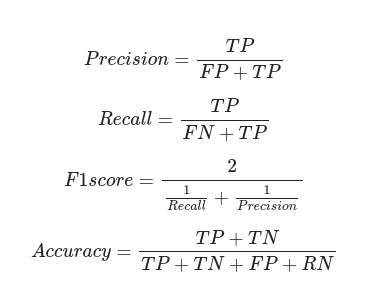

# Iris 세가지 품종 분류

### 라이브러리
 - scikit-learn
 - matplotlib
 + 설치 명령어.
 <pre><code>pip install scikit-learn
pip install matplotlib</code></pre>
 - scikit learn 제공하는 data set 문서 
 https://scikit-learn.org/stable/datasets/index.html
 
 ### data 파악 
 #### data import
 <pre>from sklearn.datasets import load_iris
iris = load_iris()
print(type(dir(iris))) 
# dir()는 객체가 어떤 변수와 메서드를 가지고 있는지 나열함
#class 'list'
</code></pre>

- 쥬피터 파일 참조..............   
============================================================

### memo

 - 라벨(target) : 머신러닝 모델이 출력해야 되는 정답

 - pandas : python 라이브러리, 2차원 배열 데이터 다르는 도구
 
<pre><code>import pandas as pd

print(pd.__version__)</code></pre>

- 문제지 : 머신러닝 모델에게 입력되는 데이터. feature라고 부르기도 한다. 변수 이름으로는 X를 많이 사용한다.   
- 정답지 : 머신러닝 모델이 맞추어야 하는 데이터. label, 또는 target이라고 부르기도 한다. 변수 이름으로는 y를 많이 사용한다.
 
 
 - 학습에 사용하는 training dataset과 모델의 성능을 평가하는 데 사용하는 test dataset으로 데이터셋을 나누는 작업이 필요
 - 
 
 ***random_state , random_seed   
    정렬된 데이터를 섞는 랜덤 기준 수치,   
    다시하거나 다른 pc에서 할때도 같은 결과를 얻기 위해   
### 지도학습 (Supervised Learning), 비지도 학습 (Unsupervised Learning)
#### 지도학습
 - 분류(Classification)와 회귀(Regression)
 - 분류[classification]: 입력받은 데이터를 특정 카테고리 중 하나로 분류해내는 문제
 - 회귀[regression]: 입력받은 데이터에 따라 특정 필드의 수치를 맞추는 문제
     
 
#### decision tree(의사결정 나무)   
- ref_link : https://ratsgo.github.io/machine%20learning/2017/03/26/tree/
- 분류 회귀 다가능.
- 도(homogeneity)가 증가, 불순도(impurity) 혹은 불확실성(uncertainty)이 최대한 감소하도록 하는 방향으로 학습을 진행합니다. 순도가 증가/불확실성이 감소하는 걸 두고 정보이론에서는 정보획득(information gain)

#### 엔트로피   (2-4) 
-ref link1  https://eehoeskrap.tistory.com/13   
-ref link1 https://www.youtube.com/watch?v=zJmbkp9TCXY
- 의미:   
엔트로피(Entropy)는 주어진 데이터 <b>집합의 혼잡도</b>를 의미한다. 즉, 주어진 데이터 집합에서 서로 다른 종류의 레코드들이 섞여 있으면 엔트로피가 높고, 같은 종류의 레코드들이 섞여 있으면 엔트로피가 낮다.
엔트로피 값은 0에서 1사이의 값을 가지며, 가장 혼합도가 높은 상태의 값이 1이고, 반대는 0이다.(하나의 레코드로만 구성된 상태의 값) Decision Algorithm에서는 엔트로피가 높은 상태에서 낮은 상태가 되도록 데이터를 특정 조건을 찾아 나무 모양으로 구분해나간다.

-이해:

   각 라벨들의 확률분포의 함수.
   내가 가진 정보의 양과 라벨들의 최적으로 압축할 수 있는 것.
   
 
 

- 계산 식:

_지니계수 (gini index)
  - 지니계수 공식
  
 

- 오분류오차(misclassification error)   

   -> 미분 불가능
- 모델학습   
   -> 재귀적 분기(recursive partitioning)
   -> 가지치기(pruning) 

- 발생 문제

- 가지치기의 비용함수
CC(T)=Err(T)+α×L(T)
CC(T)=의사결정나무의 비용 복잡도(=오류가 적으면서 terminal node 수가 적은 단순한 모델일 수록 작은 값)

ERR(T)=검증데이터에 대한 오분류율

L(T)=terminal node의 수(구조의 복잡도)

Alpha=ERR(T)와 L(T)를 결합하는 가중치(사용자에 의해 부여됨, 보통 0.01~0.1의 값을 씀)

#### 랜덤포레스트(random forest )
- ref_link : https://medium.com/@deepvalidation/title-3b0e263605de

- 앙상블 (Ensemble) 기법

#### SVM (support vector machine)
- ref_link : https://excelsior-cjh.tistory.com/66?category=918734
>> 블로그 다시 다 ...
- MMH 최대 마진 초평면 
- 서포트 벡터
- KKT`
- 하드 마진
- 소프트 마진

#### SGD (stochastic Gradient Descent Classifier)
- ref_link : https://scikit-learn.org/stable/modules/sgd.html

##### Logistic regression 
- ref_link : http://hleecaster.com/ml-logistic-regression-concept/

#### 정확도의 함정

 - 데이터의 밸런스가 불균형 하면...
##### 오차행렬
- ref link https://manisha-sirsat.blogspot.com/2019/04/confusion-matrix.html
- ref link https://m.blog.naver.com/kiddwannabe/221369816719

- tn / fn / tp / fp

- 성능 지
1. 정밀도(precision)
2. negative predictive value
3. sensitivity
4. specificity
5. accuracy표
- 정밀도(Precision), 재현율(Recall, Sensitivity), F1 스코어(f1 score)

- 상황별 중요지표
 -> 암은 실제로 암에 걸린사람이 중요(암에 걸렸는데, 암에 안걸렸다고 하면 사)
 -> 스팸판독기는 스팸이라고 예측하는 것이중요(즉 스팸이 아닌데 스팸이라고 하면 사고고)

- f1 정밀도, 재현율 평균값 

- 2-9 결론 : 데이터 레이블의 비중이 한쪽으로 치우쳐지면 전체적인 정확도가 높아도 모델의 유효성(?)이 떨어질 수 있다.
 
 
 
 
 
 