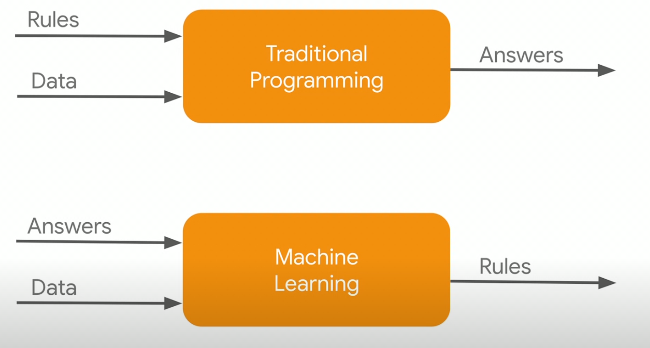
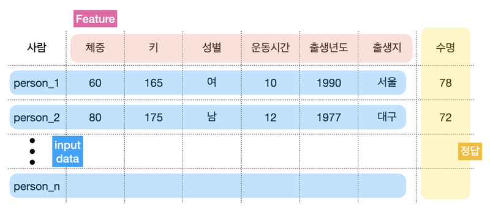
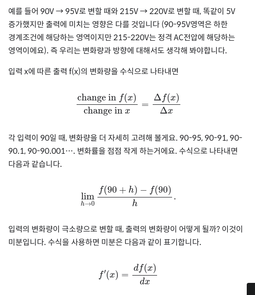
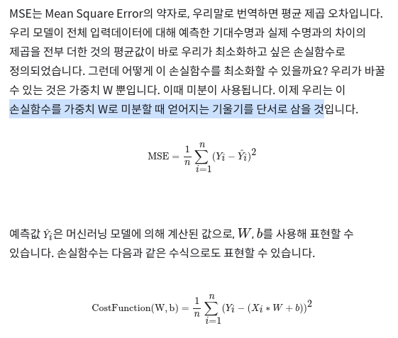
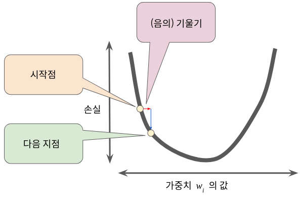

### 목차 
#### 인공지능의 시작과 역사
#### 머신러닝 "Paradigm Shift"
- 머신러닝 Paradigm Shift - Rule
- 머신러닝 Paradigm Shift - Workflow
- 머신러닝 Paradigm Shift - Feature from data
####미분과 머신러닝
- 시스템과 미분
- 파이썬 미분 구현
- 머신러닝과 미분차

### 시작
#### 1940-50
- 앨런 튜링
- 튜링머신, 보편튜링머신()
- 폰노이만 구조: 보편튜링머신이 사람처럼 생각

#### 1960-70
- 추론 / 탐색
- P versus NP problem:   
   --> ref .link https://namu.wiki/w/P-NP%20%EB%AC%B8%EC%A0%9C
#### 80-90
- 전문가 시스템(experts system) : 특정영역으로 접근

#### 90 - 00

### paradigm shift
- 머신러닝개념: 기계 학습 또는 머신 러닝은 인공 지능의 한 분야로서, 데이터를 평가하고 처리하는 과정에서 쌓인 경험을 통해 기계가 과업 처리 성능을 자동 개선하도록 하는 컴퓨터 알고리즘 연구 분야
- 명시적인 프로그래밍
- 전통 적인 프로그래밍 vs

- 딥러닝
   --> 신경망(뉴런), 퍼셉트론 구조, 패턴학습
      역전파(back propagation)

- 머신러닝 workflow   
   --> 훈련, 추론   
   --> data collect(feature,)   
   --> data preparation : balance, split(training, evaluation), recollect(copy, nomalization, ....)   
   --> choosing model :   
   --> training: weights, biases(편향)   
   --> evaluation   
   --> parameter tuning: hyper parameter   
   --> prediction :  
     
- 훈련 및 평가 데이터
    --> 학습 세트   
    --> 평가 세트   
    --> 머신러닝 성능 향상을 위한 data   
        data 많이
        argumentation :  단일 데이터를 부풀림
         ex) 그림 좌우번전 / 잘라서 / 밝기 조절 
        AlexNet / VGGNet / ResNet   
        rotation ,shifting, rescaling, flipping, shearing, stretching
- data

        
   --> 특성(feature):입력 데이터의 속성,    
   --> 가중치(w): 
   --> 입력데이터    
   --> 정답데이터()   
   
   
   ### 미분과 머신러닝
   ####
-  경사하강법(미분을 통해 가중치와 bias 를 구함)
-  미분 TODO 이해하기

#### 미분과 머신러닝
- Loss Function
- mse (mean square error)    
   
- 손실함수의 기울기와 경사 하강법
      
 - 경사하강법 종류 LINK : https://medium.com/@lachlanmiller_52885/machine-learning-week-1-cost-function-gradient-descent-and-univariate-linear-regression-8f5fe69815fd

#### ?
- 정지문제 halting problem

      

 
